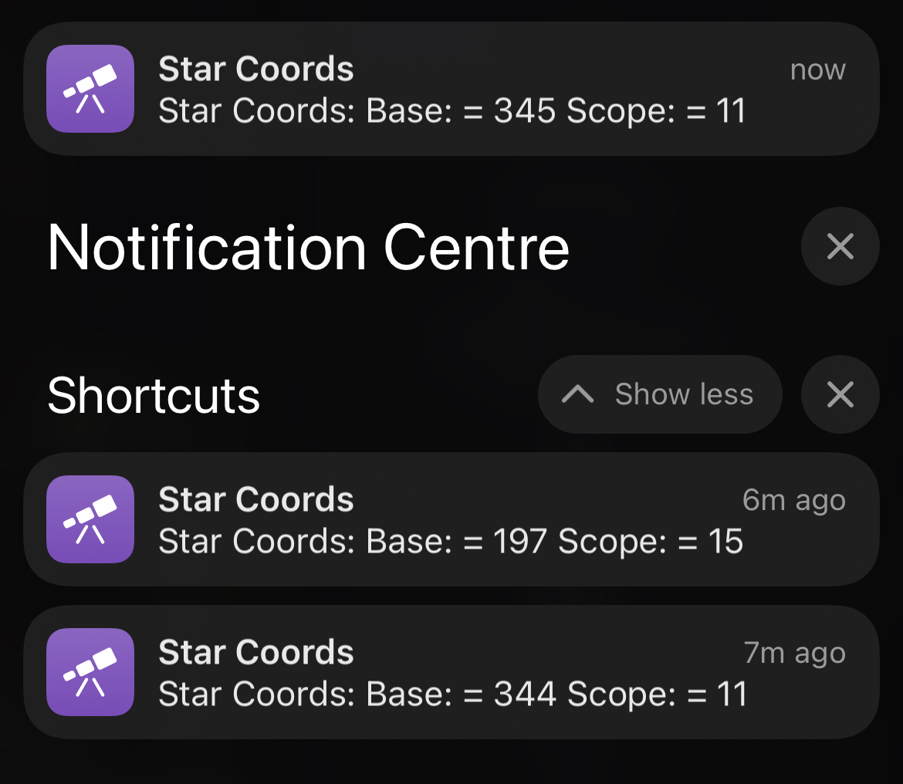
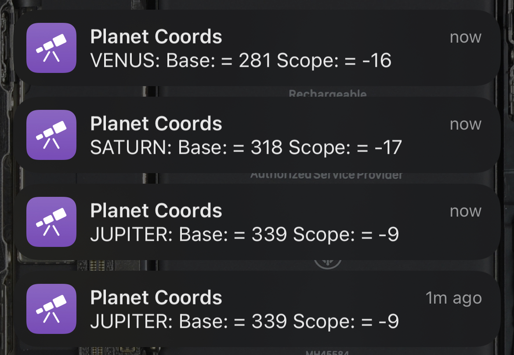
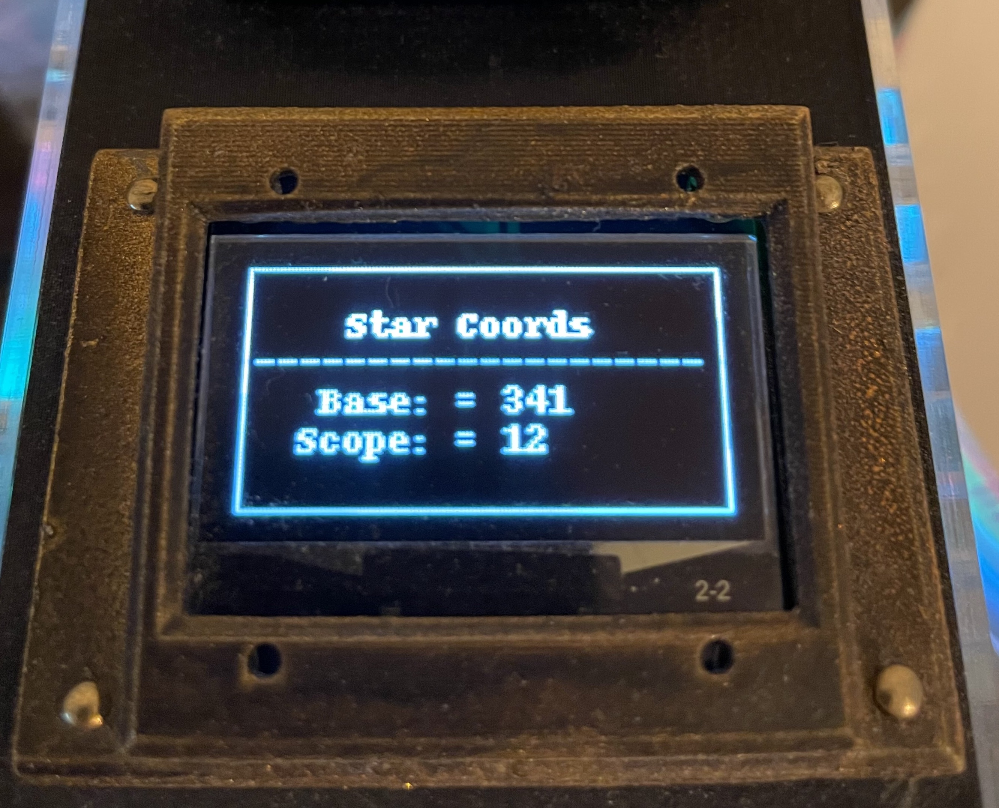
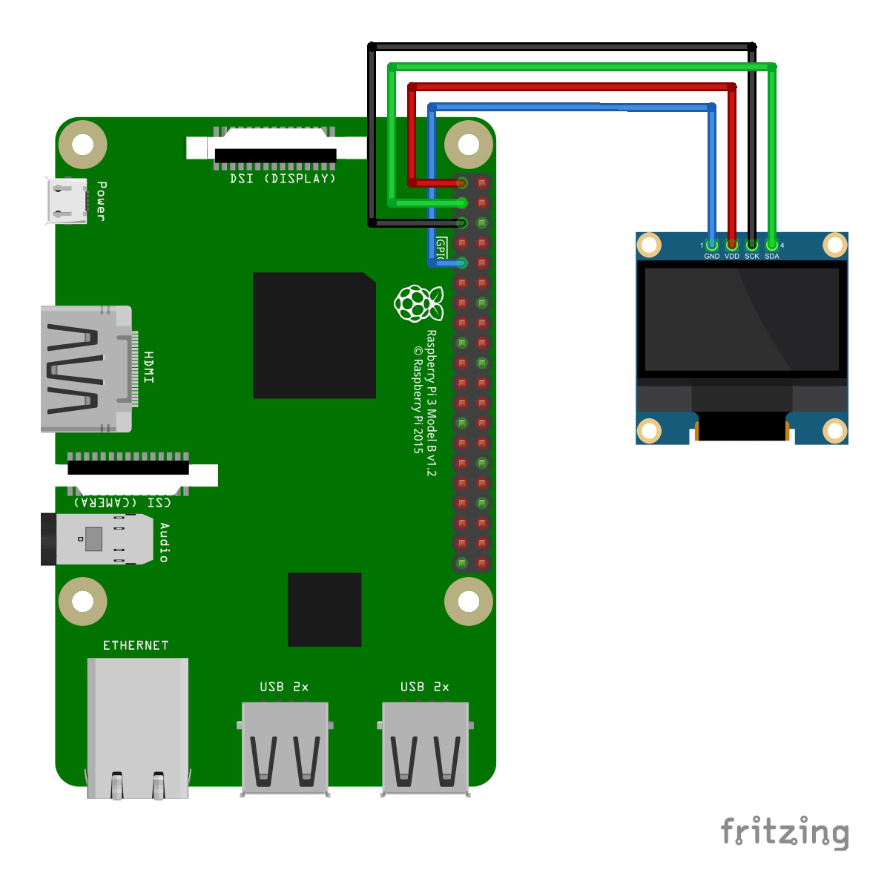

# Star Coordinates

Get the AltAz coordinates for a given object using astropy and output on a OLED screen.

As a very very newcomer to the astronomy scene and living in a area with a bit higher light pollution I find it's necessary to get the AltAz coordinates for an object to help me find it.

My understanding is the the Alt is a degree point ona 360 degree circle where 0 is True North. and Az is a degree of elevation or tilt the telescope has within a range of -90 to 90 degrees. Where as other from 0 to 90 is visible, although based on my elevation anything from 30 to 90 is more likely.

# Dependencies

The whole thing has been written using Python 3+

- [luma.oled](https://pypi.org/project/luma.oled/)
- [numpy](https://pypi.org/project/mumpy/)
- [astropy](https://www.astropy.org)


# Install

```
sudo apt-get install git python3-pip libatlas3-base libopenjp2-7 i2c-tools
sudo pip3 install luma.oled
sudo pip3 install astropy
sudo pip3 install numpy
cd /home/pi/
git clone https://github.com/ccmehil/star_coords.git
```

# Configuration

To determine the address for your OLED screen

```sudo i2cdetect -y 1```

Now to do an initial start and get the config file

```python /home/pi/star_coords/server.py```

Running the program the first time will write a configuration file. You will need to edit this file so ```CTRL-C``` to exit the program if it has not already. You can of course use whatever editor you like here I chose ```nano```

```nano /home/pi/star_coords/server.ini```

```
[server]
name=10.0.0.1
port=8080

[site]
address=Greenwich
latitude=51.4874277
longitude=-0.012965
```

 Server name is the IP or hostname of the Raspberry Pi. To set your own specific Lat/Lon you can use the ```setuphelp.py``` program, just modify the *myaddress* before you run it.

# Troubleshooting

If you are getting odd errors related to ```numpy``` you may need to do the following.

```
pip3 uninstall numpy
sudo apt-get remove python3-numpy
sudo pip3 install numpy
```

# Usage

```python /home/pi/star_coords/server.py```

To use the server once it is running you will need to make an HTTP request.

> http://10.0.0.1:8080?messier=M41

The IP address of course is whatever that of your Raspberry Pi is and the parameter "messier=XXX" is a object from the [Messier Catalog](https://en.wikipedia.org/wiki/Messier_object).

If you are an Apple user you can use this [Apple Shortcut](https://www.icloud.com/shortcuts/ba09a1a658c7462484d6e64e5392c1a3) I made to interact with the server while star gazing. Siri will even react via voice input over your Apple Watch or by asking "Hey Siri"



With the current version you can also search for a planet. This is an either or type of search either a Messier Object or a Planet, not both.

> http://10.0.0.1:8080?planet=mars

Another [Apple Shortcut](https://www.icloud.com/shortcuts/8eb5d1e27f044187959cbe59aadaaea7) I made is to interact with the server while looking for a planet. Siri will even react via voice input over your Apple Watch or by asking "Hey Siri"



# Hardware

I'm using a sh1106 module for the OLED display and a [Raspberry Pi Zero W](https://www.raspberrypi.com/products/raspberry-pi-zero-w/) 





# Extras

This is a project by a hobby newbie, I've had a telescope for less than a month when I created this project and I'm still learning, lingo and other associations. All feedback, contribution and engagement is welcome! Python is also relatively new to me. 

- [Code of Conduct](docs/CODE_OF_CONDUCT.md)
- [License](docs/LICENSE)

# TODO

- Use command line arguments to set server and port for first install or even trigger the creation of the configuration file and prompt the user to edit it?
- move server binding and port to command and not in config?
- add OLED true/false to config
- add I2C address to config
- provide dummy config to GIT for project?
- Combine auto lookup of Lat/Lon from setuphelp.py into main program
- add url param to shutdown the server?
- add url param for Lat/Lon updates? Good be good if you are moving around with your telescope

# OPTIONAL (not tested)

Don't do this unless you are sure it's running properly with your information saved and taken care.

````
sudo nano /etc/profile
```

Scroll to the bottom and add the following line

```
sudo python /home/pi/star_coords/server.py
```

This will start the server on boot/reboot.