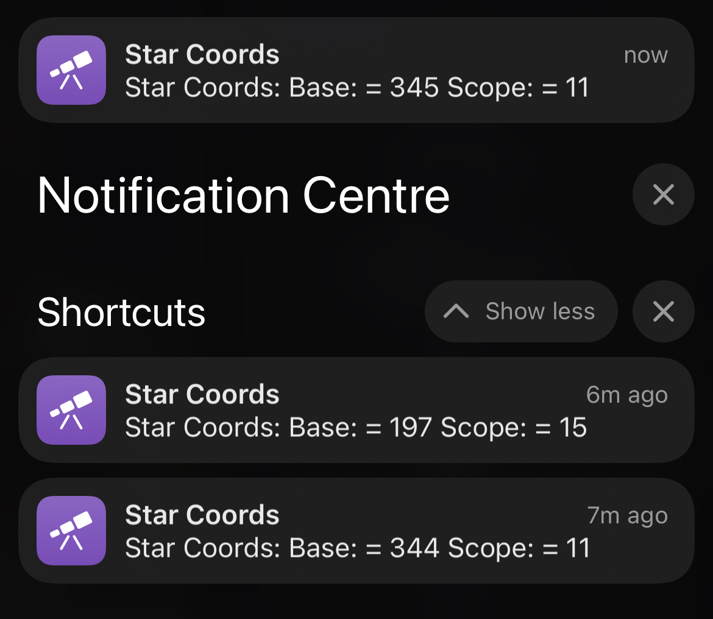
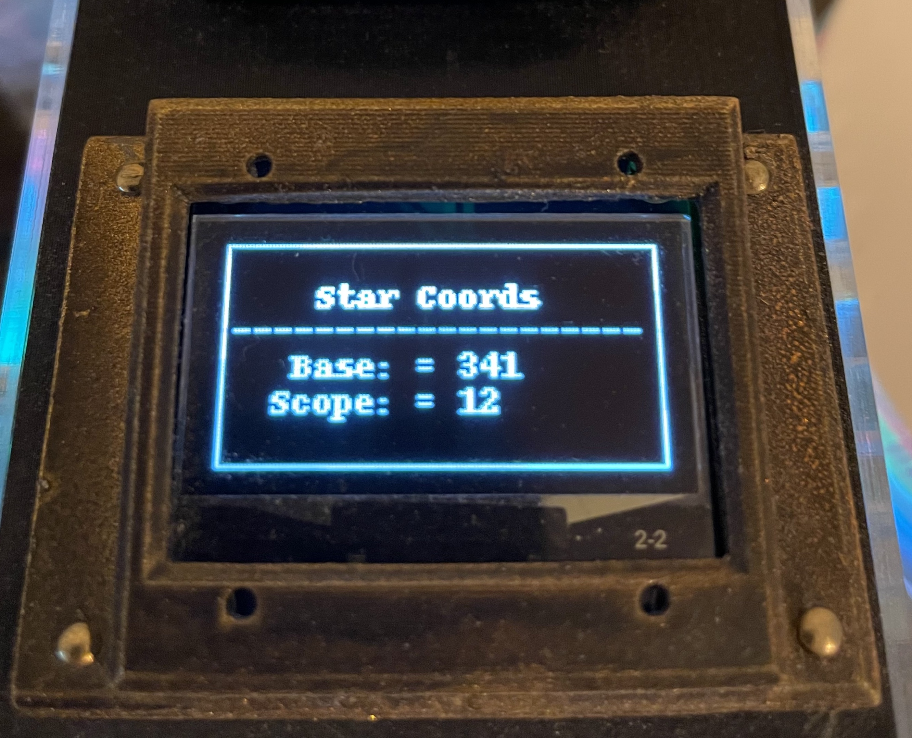
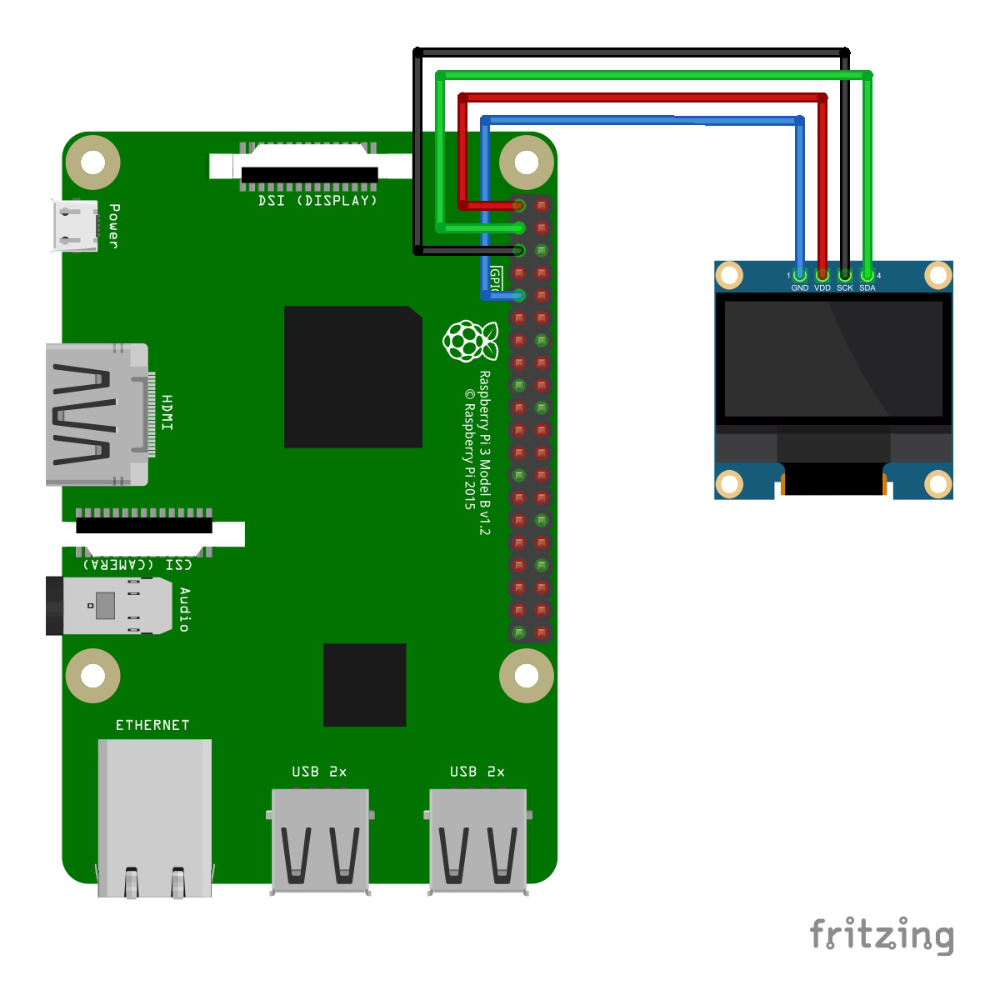

# Star Coordinates

Get the AltAz coordinates for a given object using astropy and output on a OLED screen.

As a very very newcomer to the astronomy scene and living in a area with a bit higher light pollution I find it's necessary to get the AltAz coordinates for an object to help me find it.

My understanding is the the Alt is a degree point ona 360 degree circle where 0 is True North. and Az is a degree of elevation or tilt the telescope has within a range of -90 to 90 degrees. Where as other from 0 to 90 is visible, although based on my elevation anything from 30 to 90 is more likely.

# Dependencies

> [luma.oled](https://pypi.org/project/luma.oled/)

# Usage

> python3 server.py

To use the server once it is running you will need to make an HTTP request.

> http://10.0.0.1:8080?messier=M41

The IP address of course is whatever that of your Raspberry Pi is and the parameter "messier=XXX" is a object from the [Messier Catalog](https://en.wikipedia.org/wiki/Messier_object).

If you are an Apple user you can use this [Apple Shortcut](https://www.icloud.com/shortcuts/ba09a1a658c7462484d6e64e5392c1a3) I made to interact with the server while star gazing. Siri will even react via voice input over your Apple Watch or by asking "Hey Siri"

# To Do

Incorporate other objects than just those of the Messier Catalog, such as the planets.

# Hardware

# Extras

This is a porject by a hobby newbie, I've had a telescope for less than a month whenI created this project and I'm still learning, lingo and other associations. All feedback, contribution and engagement is welcome! Python is also relatively new to me. 

- [Code of Conduct](CODE_OF_CONDUCT.md)
- [License](LICENSE)
