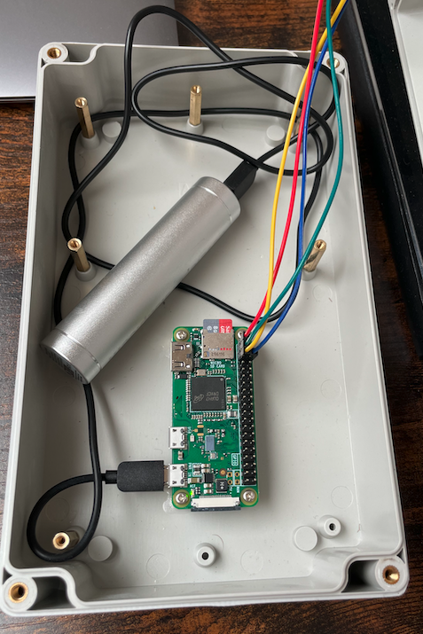
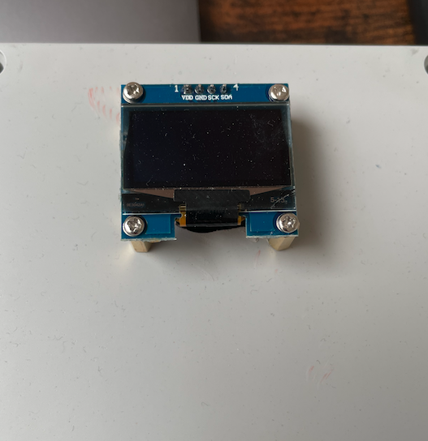

# Hardware

I'm using a sh1106 module for the OLED display and a [Raspberry Pi Zero W](https://www.raspberrypi.com/products/raspberry-pi-zero-w/) 

I've been putting together a simple box to house the Raspberry Pi W running it off a small USB battery pack with the display mounted in the top of the box. The large box allows for the addition of a small notepad on the top to indicate the objects of interest for the evening.

