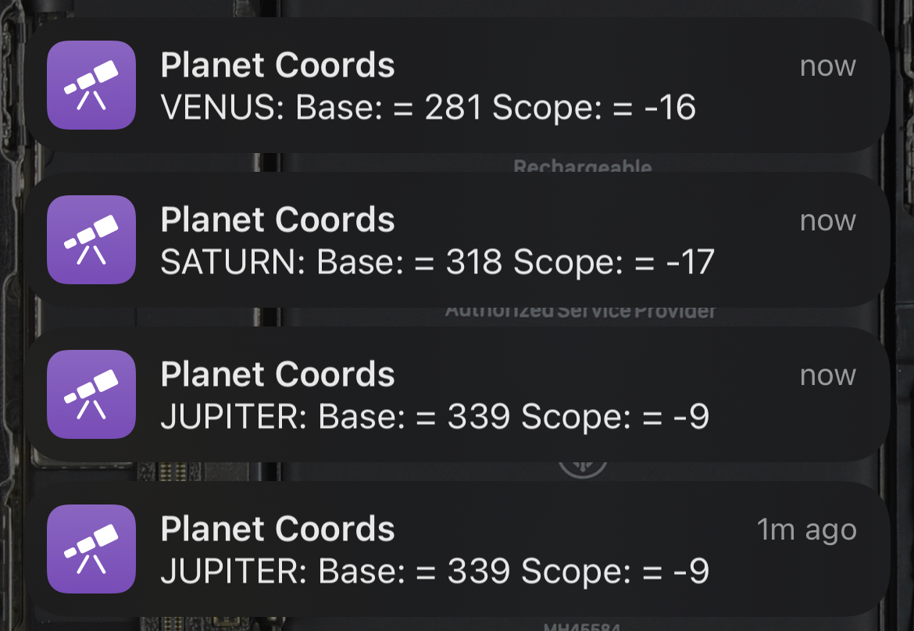

# Usage

```python /home/pi/star_coords/server.py -d TRUE -s 10.0.0.1 -p 8080```

- > -d either TRUE or FALSE if you want to use the OLED display or not, no value defaults to TRUE
- > -s is your hostname or IP of your Raspberry Pi, mine the hostname is ```starcoords```so I would give ```starcoords.local``` no value will result in it getting the hostname and adding ```.local``` automatically.
- > -p is the port number for the server to start on, no value will default to 8080


To use the server once it is running you will need to make an HTTP request. It's important to **NOTE** that you need internet access for your Raspberry Pi to work! The Raspberry Pi needs to be connected to a hotspot or Wifi with Internet access and then you access it via a device on the same network as the Raspberry Pi.

Your first request should be to set your location. This can be your specific street address, etc. If you do this via an [Apple Shortcut](https://www.icloud.com/shortcuts/9d29a74ce7744c2580c74f36ab9dfa5a) you can use the mapping function to get your address. In these examples the IP address of course is whatever that of your Raspberry Pi or your hostname you gave above when starting the server.

> http://10.0.0.1:8080?address=Greenwich

You can also use specific Latitude, Longitude and Altitude to set your location, for example with this [Apple Shortcut](https://www.icloud.com/shortcuts/9034da0e573f4ca7b60f4f4a5cf610d6)

> http://10.0.0.1:8080?lat=51.1&lon=1&alt=32

You can also deactivate or activate the OLED display from a HTTP call as well.

> http://10.0.0.1:8080?display=TRUE

Otherwise you can use either the ```messier``` or the ```planet``` parameters to search for your object based on your current location.

> http://10.0.0.1:8080?messier=M41

The parameter "messier=XXX" is a object from the [Messier Catalog](https://en.wikipedia.org/wiki/Messier_object).

If you are an Apple user you can use this [Apple Shortcut](https://www.icloud.com/shortcuts/ba09a1a658c7462484d6e64e5392c1a3) I made to interact with the server while star gazing. Siri will even react via voice input over your Apple Watch or by asking "Hey Siri"


With the current version you can also search for a planet. This is an either or type of search either a Messier Object or a Planet, not both.

> http://10.0.0.1:8080?planet=mars

Another [Apple Shortcut](https://www.icloud.com/shortcuts/8eb5d1e27f044187959cbe59aadaaea7) I made is to interact with the server while looking for a planet. Siri will even react via voice input over your Apple Watch or by asking "Hey Siri"



To stop the server once it is running you will need to make an HTTP request.

> http://10.0.0.1:8080?getout=true
